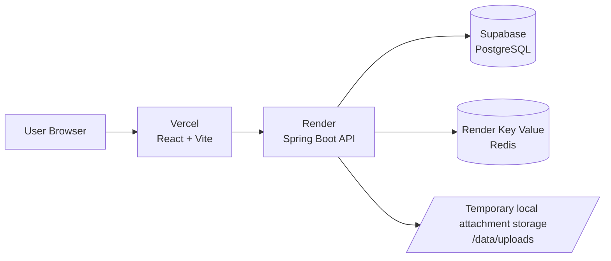

# PulseLink

PulseLink is a real-time social messaging platform built as a React + Spring Boot modular monolith and deployed to a live Vercel, Render, and Supabase stack.

[](https://pulselink-iota.vercel.app)
[](https://pulselink-api.onrender.com/actuator/health)
[](https://pulselink-iota.vercel.app)
[](https://pulselink-api.onrender.com)
[](https://supabase.com)

## Live Demo

- Application: https://pulselink-iota.vercel.app
- API Health: https://pulselink-api.onrender.com/actuator/health

> The backend runs on a free Render instance. The first request after a period of inactivity may take 30-60 seconds while the service wakes up.

[Open PulseLink](https://pulselink-iota.vercel.app)

## What is shipped

The current codebase covers the core product surface:

- Authentication and account management: register, login, refresh, logout, profile updates, password changes, and security sessions.
- Social graph flows: people search, friend requests, accept or decline, remove friendship, block, and unblock.
- Messaging: direct and group conversations, realtime updates, read tracking, reactions, edit and delete, saved messages, and search.
- Notifications and privacy: notification inbox, read state, and privacy settings.
- Trust and safety: user reports, moderation review, bounded evidence access, user administration, group moderation, and audit logs.
- Media: private attachment upload and download plus avatar upload and download.

## Current status

- Design baseline: complete
- Phase 0 - Architecture Refactor: complete
- Phase 1 - Core Application: substantially complete
- Phase 2 - Production Deployment: complete
- Remaining work: tracked in docs under next improvements, known limitations, future work, and post-deployment hardening

## Deployment architecture



## Tech Stack

- Frontend: React 19, TypeScript, Vite, React Router, TanStack Query, Zustand
- Backend: Java 21, Spring Boot, Spring Security, JPA, WebSocket/STOMP, Flyway
- Data: Supabase PostgreSQL, Render Key Value, temporary local attachment storage
- Verification: JUnit, Spring Boot Test, Vitest, React Testing Library, GitHub Actions

## Repository layout

```text
apps/
├── api/  Spring Boot API
└── web/  React web client
docs/     product and system design baseline
```

Backend module boundaries are `auth`, `friend`, `conversation`, `notification`, `privacy`, `report`, `group`, `admin`, `storage`, `search`, `saved`, `realtime`, and `shared`.

## Run locally

Prerequisite: Docker Desktop with Docker Compose.

```bash
docker compose up --build
```

Then open:

- Web: http://localhost:5173
- API status: http://localhost:8080/api/v1/system/status
- API health: http://localhost:8080/actuator/health

Stop services with:

```bash
docker compose down
```

Use `docker compose down -v` only when you intentionally want to delete local database and Redis data.

## Verification

Backend:

```bash
cd apps/api
./mvnw verify
```

Frontend:

```bash
cd apps/web
npm ci
npm run lint
npm test
npm run build
```

## Next steps

- Migrate attachment storage to Supabase Storage or another persistent object store.
- Add more automated coverage for production journeys.
- Tighten runtime observability, rate limiting, and deployment validation.
- Consider a custom domain and stronger post-deploy hardening once the demo stabilizes.
