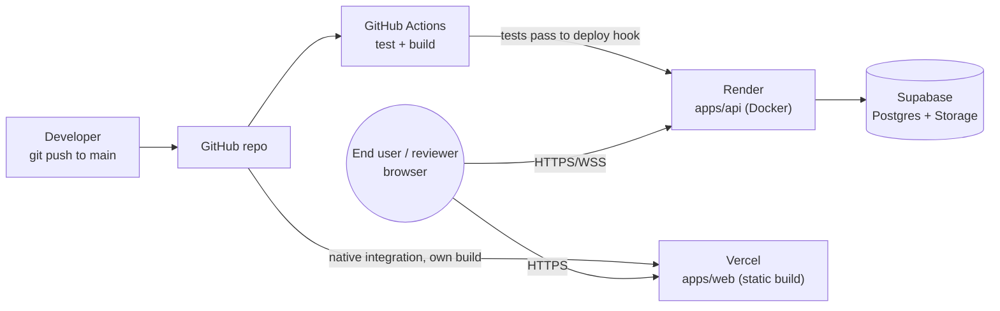
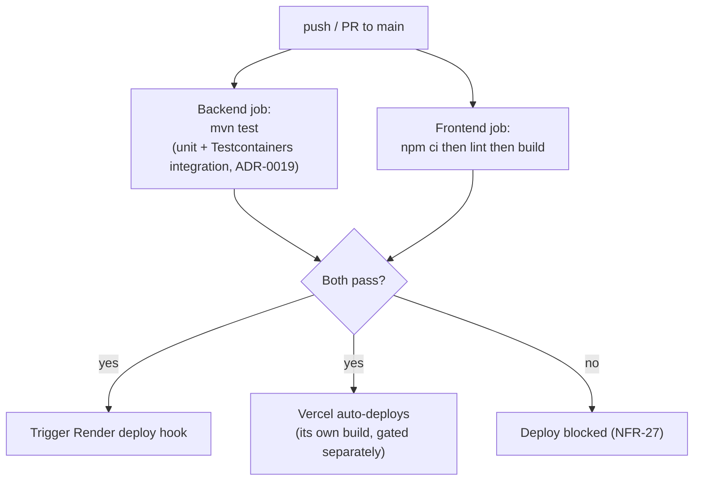

# Deployment & CI/CD

Implements ADR-0018. See that ADR for the reasoning; this document is the
concrete pipeline/topology.

## Deployment topology

## CI pipeline (GitHub Actions)

Backend and frontend jobs run in parallel (independent, per ADR-0001's
monorepo path separation) — a frontend-only change doesn't wait on a
Postgres Testcontainers boot, and vice versa.

## Environments
Two, for this stage:
- **Local** — `docker-compose.yml` (ADR-0006): local Postgres/Redis
  containers, `.env`-driven config.
- **Demo/production** — Render + Vercel + Supabase, as above. No separate
  "staging" environment yet — acceptable for a solo-developer portfolio
  project (NFR-13 already disclaims a formal SLA); would be a real gap to
  close before any team or paying users existed.

## Secrets
| Secret | Lives in |
|---|---|
| `JWT_SECRET` | Render environment variables + GitHub Actions secret (test env uses a separate throwaway value) |
| Supabase DB/Storage credentials | Render environment variables |
| Render deploy hook URL | GitHub Actions secret |
| VAPID keys (ADR-0016) | Render environment variables |

Never committed — enforced by the existing `.gitignore` rule
(`.env*` ignored, `.env.example` explicitly whitelisted as a template).

## Known gaps (named, not silently skipped)
- No staging environment / blue-green or canary deploys — a direct
  push-to-main-deploys-to-prod pipeline, acceptable at this project's
  stage (NFR-13).
- No automated rollback on a bad deploy — would need to be added before
  this handled real user traffic.
- No end-to-end (browser-level) test stage in CI yet — see
  `../testing/strategy.md` for why that's called out as a deliberate,
  later addition.
