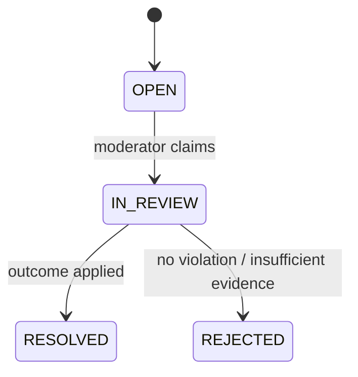

# Moderation & Administration Design

## Portal boundary

The portal is a lazy-loaded `/admin` route tree inside the existing React application, with its own shell and navigation. It reuses authentication, API client, design tokens, CI, and deployment while keeping components/state separate enough for later extraction.

## Report targets and reasons

Targets: `USER`, `MESSAGE`, `GROUP`.

Reasons: `SPAM`, `HARASSMENT`, `HATE_SPEECH`, `SEXUAL_CONTENT`, `VIOLENCE`, `IMPERSONATION`, `SCAM`, `OTHER`; `OTHER` requires description.

## Workflow

Terminal outcomes are `NO_ACTION`, `WARNING`, `CONTENT_REMOVED`, `USER_SUSPENDED`, `USER_BANNED`, `GROUP_CLOSED`. Outcome authorization is checked independently from report-review permission.

## Evidence and privacy

Submission creates an immutable minimized snapshot. A message snapshot contains author ID, content at report time, attachment metadata (never a signed URL), timestamp, conversation ID, and integrity identifiers. During review the service may load only five messages before/after the target message. There is no general “open conversation as admin” API.

## Resolution transaction

1. Lock report and verify its current state.
2. Re-check actor role, staff hierarchy, and target state.
3. Apply the selected action (if any).
4. Create user-facing notification when applicable.
5. Write append-only audit record with reason and before/after summary.
6. Transition the report to terminal state.
7. Commit, then publish non-sensitive realtime updates.

## User account operations

- Suspension has `suspended_until`; automatic expiry returns the account to `ACTIVE` unless another blocking state applies.
- Ban is indefinite until an authorized unban.
- Force logout revokes all refresh-token families and token version.
- Profile reset removes private avatar object and/or resets display name to a deterministic safe value.
- Staff cannot act on equal/higher roles.

## Group operations

System closure differs from a group admin's membership management. `CLOSED` preserves group history and membership but blocks send, add/remove, transfer, and avatar/name changes until an `ADMIN+` reopens it.

## Audit

Every privileged mutation and every evidence-access event is immutable. No update/delete audit endpoint exists. Audit payloads contain selected fields, never passwords, raw tokens, full private chat history, or signed URLs.
