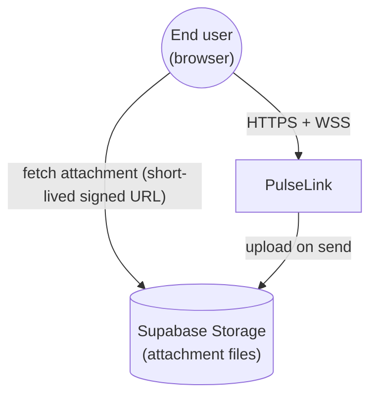
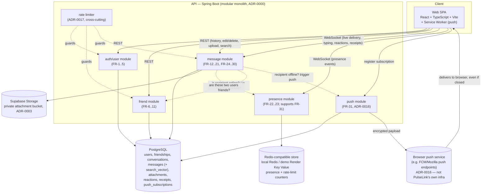
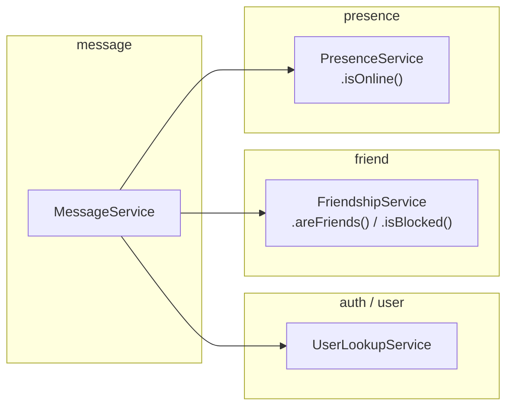

# System Design — Full Scope

Target shape of the whole system, derived from `docs/requirements/`.
**Nothing in this system is built yet** (verified 2026-07-17) — this is
the map the implementation will follow.

## C1 — System context



## C2 — Containers



Key ties to requirements:
- **Friend gate** (ADR-0008): the `message` module never creates a direct
  conversation without checking `friend` module state first — this is the
  single most important cross-module dependency in the system.
- **Private attachments use authorized signed URLs** (ADR-0003): the API
  accepts uploads and stores an immutable object key. For reads, the client
  requests message/history data; after checking active conversation membership,
  the API supplies a short-lived signed URL. The browser then downloads the
  bytes directly from Supabase Storage, so authorization remains server-side
  without proxying the file body through the API.
- **The Redis-compatible store only holds what is safe to reconstruct** (presence and rate-limit windows) — nothing
  required by NFR-12 (message durability) touches it.

## C3 — Module boundaries



Every module boundary here is a single, named service method — the
concrete mechanism (per ADR-0000) that makes a later extraction possible
without a rewrite: if code respects this boundary now, splitting `friend`
or `presence` into its own deployable later is a network call replacing
a method call, not a redesign.

## Data flow: sending a direct message (target design)

```mermaid
sequenceDiagram
    participant Sender as Sender (WebSocket)
    participant Msg as message module
    participant Friend as friend module
    participant DB as PostgreSQL
    participant Storage as Supabase Storage
    participant Presence as presence module
    participant Recipient as Recipient (WebSocket, if online)
    participant Push as push module / browser push service

    Sender->>Msg: send message (conversationId, text, [attachment])
    Msg->>Friend: are sender & recipient friends, not blocked?
    Friend-->>Msg: yes
    opt has attachment
        Msg->>Storage: upload file to private bucket
        Storage-->>Msg: immutable object key
    end
    Msg->>DB: persist message (+ message_attachments row if any)
    Msg->>Presence: is recipient online?
    alt online
        Presence-->>Msg: yes
        Msg->>Recipient: push over WebSocket (NFR-1: <500ms)
    else offline
        Presence-->>Msg: no
        Msg->>Push: send best-effort Web Push if subscription exists
        Push-->>Recipient: notification via service worker (FR-31)
        Note over Recipient: on open/reconnect, fetch REST history;<br/>PostgreSQL remains the source of truth
    end
    Msg-->>Sender: ack (persisted)
```

## What this design deliberately does not solve yet
- Multi-instance WebSocket fan-out (ADR-0007's named future trigger).
- Retry/dead-letter handling for failed push notifications (ADR-0016).
- Fuzzy/relevance-ranked search (ADR-0015 — exact keyword matching only).
- Virus scanning or thumbnailing of uploaded attachments (explicit NFR
  exclusion).

See [`deployment.md`](./deployment.md) for how this system reaches the
outside world (hosting, CI/CD) and [`../testing/strategy.md`](../testing/strategy.md)
for how it's verified before it gets there.
