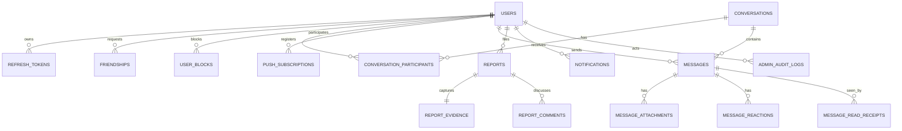

# Database Schema — Full System Design

PostgreSQL is the durable source of truth. Presence, typing, and rate-limit windows are intentionally absent from this schema and live in Redis-compatible ephemeral storage. Flyway owns migrations; Hibernate uses `ddl-auto=validate`.

## Entity relationship

## Table inventory — exactly 16 durable tables

1. `users`
2. `refresh_tokens`
3. `friendships`
4. `user_blocks`
5. `conversations`
6. `conversation_participants`
7. `messages`
8. `message_attachments`
9. `message_reactions`
10. `message_read_receipts`
11. `push_subscriptions`
12. `reports`
13. `report_evidence`
14. `report_comments`
15. `notifications`
16. `admin_audit_logs`

## `users`

| Column | Type | Rules |
|---|---|---|
| id | UUID | PK, `gen_random_uuid()` |
| email | VARCHAR(254) | normalized lowercase, unique, not null |
| username | VARCHAR(30) | normalized lowercase unique, display casing may be separate; `[A-Za-z0-9_]{3,30}` |
| password_hash | VARCHAR(255) | BCrypt, not null |
| display_name | VARCHAR(50) | not null |
| avatar_object_key | VARCHAR(500) | nullable, private storage key |
| system_role | VARCHAR(20) | `USER|MODERATOR|ADMIN|SUPER_ADMIN`, default `USER` |
| account_status | VARCHAR(30) | `ACTIVE|SUSPENDED|BANNED|DEACTIVATION_PENDING|DEACTIVATED` |
| suspended_until | TIMESTAMPTZ | nullable; required for suspension |
| deactivation_requested_at / deactivated_at | TIMESTAMPTZ | lifecycle timestamps |
| token_version | BIGINT | increments on global session invalidation |
| last_seen_at | TIMESTAMPTZ | durable fallback; realtime presence remains Redis |
| created_at / updated_at | TIMESTAMPTZ | UTC |

Indexes: normalized email/username unique, `(account_status,created_at)`, `(system_role,account_status)`, `last_seen_at`. Application invariant preserves at least one active super admin.

## `refresh_tokens`

`id`, `user_id FK`, `family_id`, `token_hash` unique, `issued_at`, `expires_at`, `consumed_at`, `revoked_at`, `replaced_by_id`, `device_name`, `ip_hash`, `user_agent_hash`. Raw refresh token is never stored. Indexed by user/family/expiry.

## `friendships`

Canonical pair `user_low_id < user_high_id`, plus `requester_id`, `status PENDING|ACCEPTED`, timestamps. Unique pair prevents duplicate/reciprocal rows. Removing friendship deletes this relationship, not message history.

## `user_blocks`

`blocker_id`, `blocked_id`, `created_at`; PK/unique pair; check users differ. Blocking is directional and evaluated live for request, presence, and direct-message authorization.

## `conversations`

`id`, `type DIRECT|GROUP`, nullable group `name`/`avatar_object_key`, `direct_key` unique for unordered pair, `status ACTIVE|CLOSED`, `closed_at`, `closed_by`, `close_reason`, `created_by` nullable for legacy/system cases, `latest_message_id`, timestamps. Direct conversations cannot be closed through group administration.

## `conversation_participants`

`conversation_id`, `user_id`, `role MEMBER|ADMIN`, `joined_at`, `left_at`, `last_read_message_id`. Unique active membership per user/conversation. Group operations preserve exactly one current admin under the existing single-admin ADR; direct participants always use `MEMBER`.

## `messages`

`id`, `conversation_id`, `sender_id`, `client_message_id`, nullable `content`, `edited_at`, user-recall `deleted_at`, moderation fields `moderated_at`, `moderated_by`, `moderation_reason`, `created_at`, generated/stored `search_vector`. Unique `(sender_id,client_message_id)` supports idempotency. FTS excludes recalled/moderated bodies.

## `message_attachments`

`id`, optional `message_id` until finalized, `uploader_id`, immutable `object_key`, `file_name`, `mime_type`, `size_bytes <= 10MB`, checksum, `status PENDING|READY|DELETED`, timestamps. No permanent public URL is stored. Orphan pending uploads are cleaned by scheduled job.

## `message_reactions`

`message_id`, `user_id`, `emoji`, timestamps; unique `(message_id,user_id)` because one reaction per user/message replaces the prior emoji.

## `message_read_receipts`

`message_id`, `user_id`, `seen_at`; unique pair. A denormalized participant last-read pointer supports unread counts while detailed rows support per-person seen status.

## `push_subscriptions`

`id`, `user_id`, `endpoint` unique, encrypted/secret subscription keys, `created_at`, `last_success_at`. A `410 Gone` response deletes the row.

## `reports`

`id`, `reporter_id`, `target_type USER|MESSAGE|GROUP`, exactly one of `target_user_id|target_message_id|target_conversation_id`, `reason`, `description`, `status OPEN|IN_REVIEW|RESOLVED|REJECTED`, `assigned_to`, `outcome`, `resolution_summary`, `claimed_at`, `resolved_at`, timestamps. Partial unique index prevents the same reporter/target having more than one `OPEN|IN_REVIEW` report.

## `report_evidence`

One immutable row per report: `report_id` unique, `schema_version`, `evidence_jsonb`, `content_hash`, `captured_at`. Payload is versioned and minimized; it never contains a signed URL or reporter-secret metadata.

## `report_comments`

`id`, `report_id`, `author_id`, `visibility REPORTER_VISIBLE|STAFF_ONLY`, `body`, `created_at`. Comments are append-only. A reporter may add only `REPORTER_VISIBLE` clarification while the report is `OPEN`.

## `notifications`

`id`, `user_id`, `type`, safe `title`, safe `body`, optional structured `payload_jsonb`, `deduplication_key`, `read_at`, `created_at`, `expires_at`. Indexed `(user_id,read_at,created_at desc)`.

## `admin_audit_logs`

`id`, `actor_user_id`, `action`, `target_type`, `target_id`, `reason`, `request_id`, `ip_hash`, `user_agent_hash`, selected `before_jsonb`, selected `after_jsonb`, `created_at`. Append-only: no update/delete application API. Evidence reads are also recorded as audit actions.

## Delete and retention behavior

Historical chat/report/audit rows are not cascade-deleted with users. Account completion anonymizes PII and removes profile objects. Reports/evidence/audit retain 365 days; notifications 180 days. Full policy is in `data-retention.md`.

## Migration rules

- Flyway versioned migrations are immutable after deployment.
- Schema changes are reviewed with application and rollback/forward-fix strategy.
- Empty PostgreSQL must migrate to latest in CI/Testcontainers.
- JPA mappings must validate against the migrated schema.
