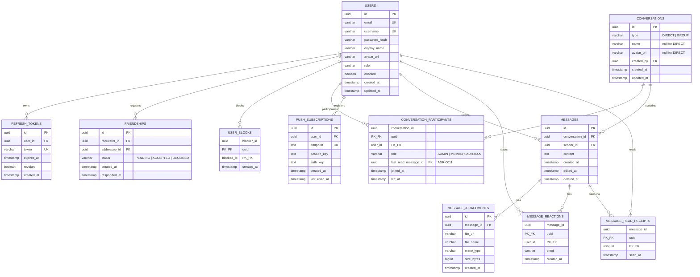

# Database Schema — Full System Design

Every table below is ⬜ **Planned** — nothing is implemented yet (verified
2026-07-09). Presence/typing state is intentionally absent — it lives in
Redis (ADR-0014), outside the durable store.

## Entity relationship

---

## `users`
| Column | Type | Constraints | Notes |
|---|---|---|---|
| `id` | UUID | PK, generated | |
| `email` | varchar(254) | unique, not null | login identifier |
| `username` | varchar(30) | unique, not null | letters/digits/underscore, used for friend search (FR-6) |
| `password_hash` | text | not null | BCrypt (ADR-0004) |
| `display_name` | varchar(50) | not null | shown in UI instead of raw username (FR-5) |
| `avatar_url` | text | nullable | points at Supabase Storage (ADR-0003) once uploaded |
| `role` | varchar(20) | not null, default `USER` | `USER` \| `ADMIN`; no admin-only endpoints exist yet, forward-looking |
| `enabled` | boolean | not null, default `true` | |
| `created_at` / `updated_at` | timestamp | not null | |

## `refresh_tokens`
Unchanged from prior auth design — see ADR-0005.
| Column | Type | Constraints |
|---|---|---|
| `id` | UUID | PK |
| `user_id` | UUID | FK → `users.id`, not null |
| `token` | varchar(512) | unique, not null (opaque random string, not a JWT) |
| `expires_at` | timestamp | not null |
| `revoked` | boolean | not null, default `false` |
| `created_at` | timestamp | not null |

## `friendships` — ADR-0008
| Column | Type | Constraints | Notes |
|---|---|---|---|
| `id` | UUID | PK, generated | |
| `requester_id` | UUID | FK → `users.id`, not null | who sent the request |
| `addressee_id` | UUID | FK → `users.id`, not null | who received it |
| `status` | varchar(10) | not null, default `PENDING` | `PENDING` \| `ACCEPTED` \| `DECLINED` |
| `created_at` | timestamp | not null | request sent time |
| `responded_at` | timestamp | nullable | non-null once accepted/declined |

**Service-layer constraint**: no duplicate pending request in either
direction between the same two users before insert (checked in code, not
a DB constraint — a symmetric uniqueness check isn't natural to express
as a single SQL UNIQUE constraint on directional rows).
**Index needed**: `(addressee_id, status)` for "my pending incoming
requests" (FR-8); `(requester_id, status)` or a combined lookup for
"are these two users friends" (checked from either direction).

## `user_blocks` — ADR-0008
| Column | Type | Constraints | Notes |
|---|---|---|---|
| `blocker_id` | UUID | PK (composite), FK → `users.id` | |
| `blocked_id` | UUID | PK (composite), FK → `users.id` | |
| `created_at` | timestamp | not null | |

One-directional by design: a block doesn't require the blocked user's
awareness or consent, and unblocking is just deleting this row (does not
resurrect any prior `friendships` row — must be re-requested per ADR-0008).

## `conversations` — ADR-0008, ADR-0009
| Column | Type | Constraints | Notes |
|---|---|---|---|
| `id` | UUID | PK, generated | |
| `type` | varchar(10) | not null | `DIRECT` \| `GROUP` |
| `name` | varchar(100) | nullable | required at service layer when `GROUP`; null for `DIRECT` |
| `avatar_url` | text | nullable | group photo (FR-16); null for `DIRECT` |
| `created_by` | UUID | FK → `users.id`, not null | the group's sole admin at creation (ADR-0009) |
| `created_at` / `updated_at` | timestamp | not null | `updated_at` bumps on new message, membership change, rename |

One table for both direct and group conversations — a direct conversation
is a `GROUP`-shaped row with exactly 2 participants and `name = null`, so
`messages`/`message_reactions`/`message_read_receipts` never need a
separate code path per conversation type.

**Service-layer constraint**: don't create a duplicate `DIRECT`
conversation between the same two users — look up an existing one first.

## `conversation_participants` — ADR-0009, ADR-0011
| Column | Type | Constraints | Notes |
|---|---|---|---|
| `conversation_id` | UUID | PK (composite), FK → `conversations.id` | |
| `user_id` | UUID | PK (composite), FK → `users.id` | |
| `role` | varchar(10) | not null, default `MEMBER` | only meaningful for `GROUP` |
| `last_read_message_id` | UUID | FK → `messages.id`, nullable | drives unread-count badge (ADR-0011); must only move forward |
| `joined_at` | timestamp | not null | also determines auto-promotion order on admin departure (ADR-0009) |
| `left_at` | timestamp | nullable | non-null once left/removed; row kept so history correctly shows who was present at the time |

**Index needed**: `(user_id)` for "list all conversations this user is
in" (loaded on every login).

## `messages` — ADR-0012
| Column | Type | Constraints | Notes |
|---|---|---|---|
| `id` | UUID | PK, generated | |
| `conversation_id` | UUID | FK → `conversations.id`, not null | |
| `sender_id` | UUID | FK → `users.id`, not null | |
| `content` | text | not null | overwritten on edit/delete (ADR-0012); can be empty string if the message is attachment-only |
| `search_vector` | tsvector | generated, not null | `GENERATED ALWAYS AS (to_tsvector('simple', content)) STORED`; powers FR-28 search (ADR-0015). Regenerates automatically on `content` change (edit/delete), so a deleted message's cleared content naturally drops out of search results. |
| `created_at` | timestamp | not null | ordering + pagination cursor |
| `edited_at` | timestamp | nullable | |
| `deleted_at` | timestamp | nullable | |

**Index needed**: `(conversation_id, created_at)` for history (FR-14);
**GIN index on `search_vector`** for search (FR-28, ADR-0015).
**Pagination**: cursor-based on `(created_at, id)`, not offset-based —
avoids degradation as history grows under concurrent inserts.

## `message_attachments` — ADR-0003
| Column | Type | Constraints | Notes |
|---|---|---|---|
| `id` | UUID | PK, generated | |
| `message_id` | UUID | FK → `messages.id`, not null | one message can have 0..N attachments |
| `file_url` | text | not null | Supabase Storage URL (signed or public, per ADR-0003's open question) |
| `file_name` | varchar(255) | not null | original filename, for display/download |
| `mime_type` | varchar(100) | not null | used client-side to decide image-preview vs generic file icon |
| `size_bytes` | bigint | not null | enforced ≤ NFR-5's 10MB cap at upload time, stored for display |
| `created_at` | timestamp | not null | |

## `message_reactions` — ADR-0013
| Column | Type | Constraints | Notes |
|---|---|---|---|
| `message_id` | UUID | PK (composite), FK → `messages.id` | |
| `user_id` | UUID | PK (composite), FK → `users.id` | |
| `emoji` | varchar(32) | not null | stores the emoji character/shortcode; reacting again updates this row (ADR-0013), doesn't insert a second one |
| `created_at` | timestamp | not null | updated on emoji change |

## `message_read_receipts` — ADR-0010
| Column | Type | Constraints | Notes |
|---|---|---|---|
| `message_id` | UUID | PK (composite), FK → `messages.id` | |
| `user_id` | UUID | PK (composite), FK → `users.id` | the reader, never the sender |
| `seen_at` | timestamp | not null | first time this user saw this message |

See ADR-0010 for why this coexists with, and is not replaced by,
`conversation_participants.last_read_message_id` (ADR-0011) — they answer
different questions (who exactly saw a message, vs. how many are unread).

## `push_subscriptions` — ADR-0016
| Column | Type | Constraints | Notes |
|---|---|---|---|
| `id` | UUID | PK, generated | |
| `user_id` | UUID | FK → `users.id`, not null | one user can have several rows (multiple browsers/devices) |
| `endpoint` | text | unique, not null | the browser push service URL for this subscription |
| `p256dh_key` | text | not null | subscription's public key, for payload encryption |
| `auth_key` | text | not null | subscription's auth secret, for payload encryption |
| `created_at` | timestamp | not null | |
| `last_used_at` | timestamp | nullable | updated on each successful push send; a send failure (410 Gone from the push service, meaning the browser invalidated it) should delete the row rather than retry it |

---

## Migration tooling
`ddl-auto=update` is fine for solo dev, but with 9 tables and several FKs/
constraints, hand-written Flyway migrations should be added **before**
implementation starts, not retrofitted after — a blocking prerequisite,
not a someday item.
