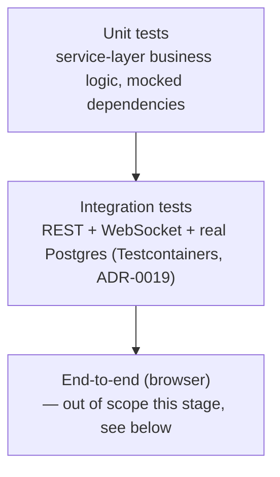

# Testing Strategy

Implements NFR-25/26. This is the plan to implement against — no tests
exist yet (repository is currently empty of business logic).

## Why this exists as its own document
"Core backend must be solid" was an explicit goal from the product owner.
A backend isn't solid because it *looks* well-designed in ADRs — it's
solid because its behavior is pinned down by tests that fail loudly the
moment reality drifts from the design. This document is where that
intent becomes concrete and checkable, not just aspirational.

## The test pyramid, mapped to this project

Most tests should be unit tests (fast, precise, one class of business
logic at a time). Integration tests exist to prove the pieces actually
wire together correctly — fewer of them, but each one exercises a real
request path.

## Unit tests — target ≥80% line coverage on `service` packages (NFR-25)

**What belongs here**: anything with a decision or calculation in it.
Concretely, by module:

| Module | Priority test targets |
|---|---|
| `auth` | `JwtService` (token generation/validation, expiry), `RefreshTokenService` (rotation, reuse-of-revoked-token rejection), `AuthService` (register/login error paths — duplicate email, wrong password) |
| `friend` | `FriendshipService.areFriends()`/`.isBlocked()` (every combination: no relationship, pending, accepted, declined, blocked-either-direction) — this is a cross-cutting gate (ADR-0008) other modules depend on, so its correctness matters disproportionately |
| `message` | Friend-gate enforcement on conversation creation, edit/delete authorization (only sender), tombstone behavior (can't edit a deleted message), reaction replace-not-append logic (ADR-0013) |
| `message` (groups) | **ADR-0009's succession algorithm specifically** — earliest-`joined_at` selection, the random tie-break among simultaneously-joined members, explicit transfer validation (target must be active), and the "last member leaves" edge case. This logic is the most intricate business rule in the whole system and deserves tests for every branch named in the ADR, not just the happy path. |
| `presence` | Online/offline determination from Redis key presence (can be tested against a real or embedded Redis — see Integration section) |
| `search` | Query-building logic (does the right `tsquery` get constructed from user input) — the actual full-text match quality is an integration concern (needs real Postgres) |
| `push` | `PushNotificationService`'s decision of *whether* to send (must check presence first) — the actual HTTP call to a push service is mocked here, verified for real in integration tests |
| rate limiting | `RateLimiter` window/threshold logic, using a fake clock rather than real `Thread.sleep` delays |

**What does NOT need dedicated unit tests**: DTOs/records (no logic),
simple getters/setters, `@Configuration` classes wiring beans (covered by
Spring context loading in integration tests instead), the JPA entities
themselves (their behavior is proven by integration tests hitting a real
DB, not by unit-testing annotations).

**Tools**: JUnit 5, Mockito (mock repositories/external calls), AssertJ
for fluent assertions.

## Integration tests — every endpoint and WebSocket destination (NFR-26)

Each REST controller and STOMP destination gets at least one test that:
1. Boots a real Spring context (`@SpringBootTest`) against a Testcontainers
   Postgres instance (ADR-0019) — not mocked repositories.
2. For REST: uses `MockMvc` or a real HTTP client against a random port,
   asserting status codes and response bodies for both success and the
   documented error cases in `api/*.md`.
3. For WebSocket: uses Spring's `WebSocketStompClient` as a test client,
   connecting, subscribing, sending, and asserting the broadcast payload
   another "participant" client receives — this is the only way to
   actually verify ADR-0007's pub/sub routing works, since unit-mocking
   the broker would prove nothing about real message routing.

**Priority scenarios** (the ones most likely to hide a real bug if
untested):
- Full auth flow: register → login → an authenticated request succeeds →
  refresh → old refresh token now rejected (ADR-0005's rotation).
- Friend-gated messaging: attempting to message a non-friend is rejected;
  after accepting a friend request, it succeeds.
- A message sent by user A over WebSocket is received by user B's
  subscribed client, persisted in Postgres, and appears in a subsequent
  `GET .../messages` history call.
- Full-text search (ADR-0015) actually returns a message containing the
  searched term and does *not* return a tombstoned (deleted) one — this
  specifically requires real Postgres, reinforcing ADR-0019's choice.
- Group admin succession end-to-end: create a group, batch-add 3 members
  at once, admin leaves without transferring, assert a successor was
  chosen from among the 3 (not asserting *which* one, since it's
  intentionally random — assert the invariant "exactly one admin exists
  afterward and it's one of the eligible members," not a specific outcome).

**Tools**: `@SpringBootTest` + Testcontainers (`postgres:16`, matching
production), a Redis Testcontainer for presence/rate-limit tests,
`WebSocketStompClient` for realtime tests.

## What's explicitly not covered yet
- **End-to-end/browser tests** (e.g. Playwright driving the actual React
  UI against a running backend) — valuable, but a real additional
  investment (browser automation infra, flakier by nature) not justified
  until the backend's own test suite is solid first. Named as a
  deliberate sequencing choice, not a permanent exclusion.
- **Load/performance testing** against NFR-1–4's specific numbers (500ms
  delivery, 500 concurrent connections) — the NFRs state targets, but no
  load-testing tool/script is set up yet to actually verify them. A real
  gap if this were being sized for production traffic.
- **Frontend unit tests** (Vitest + React Testing Library) — lighter
  priority than backend per the product owner's explicit "core backend
  must be solid" framing; worth having eventually, not the focus of this
  document.

## CI integration
Every test in this document runs in the GitHub Actions backend job
(`mvn test`) on every push/PR, gating deployment per NFR-27 and
`architecture/deployment.md` — a test suite that isn't run automatically
on every change isn't really a safety net, so this isn't optional tooling
sitting alongside the pipeline; it's a required, blocking stage of it.
